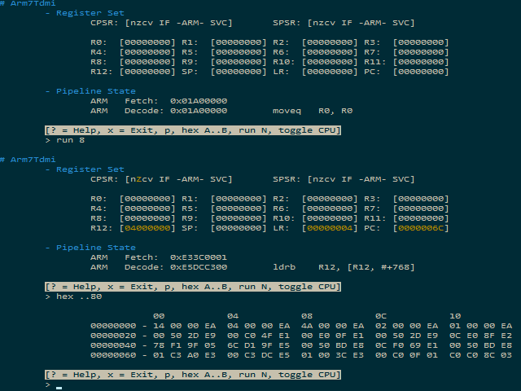

# GBArs

A GBA emulator written in Rust.

  

Thanks to a guy named Ferris and his project [Rustendo 64](https://github.com/yupferris/rustendo64), many people got motivated to write their own emulators in Rust. Even I wasn't spared, so here it is, my GBA emulator.

And why GBA?

- It is ARM-based and ARM is sexy.
- I want to play Metroid Zero Mission and Fusion with it.
- It can handle GBC games as well.

# Features

- A stupid name, pronounced: "G-B-Ars"
- Integrated debug REPL.
	- Emulate the GBA hardware step by step.
	- Hexdump sections of the GBA memory system.
	- Disassemble instructions from the GBA memory system. (TODO)
	- Modify the GBA's memory or general purpose registers. (TODO)
- Optional optimised BIOS routines. (TODO)
- It is entirely written in Rust, a safe and awesome language.
- TODO

# Build and Run

Building the emulator currently requires a nightly Rust installation, version 1.8 or higher. If you have it, you can `cd` into the source directory and do one of the following:

- To run all tests, execute `cargo test`.
- To generate an HTML documentation for the source code, execute `cargo doc`.
- To build the emulator, execute `cargo build --release`.
- To run the emulator, execute `cargo run -- ARGS...` with any command line arguments `ARGS...`. You may want to try `cargo run -- --help` to get a list of all supported command line arguments.

# Examples

- **Run a game**
	
	The SRAM file contains any saved data.
			
			GBArs --rom ./ZeroMission.gba --load-sram
			
- **Disassemble an ARM state instruction**
	
	The instruction to disassemble must be given in big endian hexadecimal format without base.
			
			GBArs --dasm-arm DEADBEEF
			
- **Run the debug REPL**
	
	The `-D`/`--debug-repl` flag makes the emulator enter the debug REPL. Usually, GBArs would reset the emulator after exiting the REPL and continue emulation normally. `-x`/`--exit`, however, makes GBArs exit before starting normal emulation. Thus, `-Dx` makes GBArs enter the REPL and exit after the REPL is done.
			
			GBArs -Dx

# Screenshots

GBArs comes with a debug REPL that highlights all changed registers and flags of the corresponding CPU. It also can show sections of the GBA memory or disassemble memory regions as instructions.

# Tools
- **[wxHexEditor](http://www.wxhexeditor.org/)**

	> a free hex editor / disk editor for Linux, Windows and MacOSX

	So far my favourite hex editor. It is obviously a GUI application based on [wxWidgets](http://www.wxwidgets.org/).
- **[ATOM](https://atom.io/)**

    > A hackable text editor

    This is quite a decent source code editor and it's what I'm currently using to develop GBArs. For this project here I at least recommend using these packages:

    - `editorconfig` for tab settings and what not.
    - `language-rust` for Rust language support.
    - `linter-rust` for showing warnings etc. in the status bar.
- **[Online Disassembler](https://onlinedisassembler.com/odaweb/)**

	> Disassembly in the cloud.

	As the name states: A website disassembling your binaries. Just copy and paste sections of your ROM files and have fun. To use it, apply the following settings:
	
	- **Arch**: ARMv4T (T = THUMB support)
	- **Endian**: Little
	- **Force THUMB Mode**: Default (Might need to toggle in case the disassembly is wrong.)
	- **Register Names**: reg-names-std (Just a matter of taste.)
	
	A hint on how you recognise whether the website erroneously disassembles ARM instructions as THUMB instructions: The first instruction of a BIOS or GamePak ROM file is almost always an unconditional ARM state branch like `b loc_00000058`.
	
	Also note that ARMv4 is just the "instruction set version". Although the GBA's CPU is an ARM7TDMI (again, T = THUMB), its instruction set is ARMv4.
- **[Rust Programming Language](https://www.rust-lang.org/)**

	> Rust is a systems programming language that runs blazingly fast, prevents segfaults, and guarantees thread safety.

	This language is just beautiful. Try it! Use it! It even provides an online book and other useful resources to learn and master this language. And if you use DuckDuckGo as a search engine, you can browse the standard library documentation using `!rust` for Rust stable or `!rustn` for Rust nightly.
- **[Cargo Package Manager](https://crates.io/)**

	> The Rust community’s crate host

	Rust's package manager. Here you can find almost all Rust packages, called "crates".

# References
- **[Rustendo64](https://github.com/yupferris/rustendo64)**

	> Livecoding a Nintendo 64 emulator in Rust :D

	This project inspired me to make this emulator. [Here](https://www.youtube.com/channel/UC4mpLlHn0FOekNg05yCnkzQ/videos) is a YouTube channel containing recordings of Ferris' Rustendo64 streams. You'll find stuff like the GitHub repository link in the video descriptions.
- **[ProblemKaputt.de - GBATEK](http://problemkaputt.de/gbatek.htm)**

	> GBATEK written 2001-2014 by Martin Korth, programming specs for the GBA and NDS hardware

	A pretty detailed one-page with almost all the information you need.
- **[ARM7TDMI ARM Instruction Set Reference](http://bear.ces.cwru.edu/eecs_382/ARM7-TDMI-manual-pt2.pdf)**
	
	> Open Access
	> 
	> This chapter describes the ARM instruction set.

	Here is a reference manual listing all ARM state instructions of the GBA's main CPU. This PDF file not only shows every instruction's standard assembly syntax, but also specifies their binary encoding and their side effects and restrictions.
- **[ARM7TDMI THUMB Instruction Set Reference](https://ece.uwaterloo.ca/~ece222/ARM/ARM7-TDMI-manual-pt3.pdf)**
	
	> Open Access
	> 
	> This chapter describes the THUMB instruction set.
	
	Like the document above, this one handles the smaller 16-bit THUMB state instructions. If you are wondering what `ARM7-TDMI-manual-pt1.pdf` is all about: Nothing of much interest for emulator development. Signaling, wiring, what not. 

# License

Licensed under the [Apache License 2.0](./LICENSE-APACHE.md).

- [https://www.apache.org/licenses/LICENSE-2.0.html](https://www.apache.org/licenses/LICENSE-2.0.html)
- [https://tldrlegal.com/license/apache-license-2.0-(apache-2.0)](https://tldrlegal.com/license/apache-license-2.0-%28apache-2.0%29)